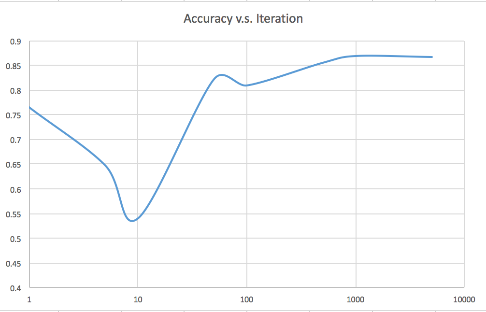

#Digital Signal Processing Homework 1
#####B03901034 吳泓霖

##Environment
```
OS: macOS 10.12.1 (16B2555)
Compiler: 	Apple LLVM version 8.0.0 (clang-800.0.42.1)
			Target: x86_64-apple-darwin16.1.0
			Thread model: posix
Processor: Intel(R) Core(TM) M-5Y71 CPU @ 1.20GHz
```

##Instructions
1. Compiling: command `make` will compile three binaries: `train, test, accuracy`
2. Training: `Usage: ./train [iteration] [Initial Model file] [Input sequence file] [output file]`
3. Testing: `Usage: ./test [Model list] [Testing Sequence file] [output file]`
4. Get accuracy: `Usage: ./accuracy [Test output file] [Answer file] [output accuracy file]`

##Additional Analysis
| Iterations | Accuracy | Running Time |
|:----------:|:-------- |:------------ |
| 1          | 0.766    | 0.843s       |
| 5          | 0.6484   | 3.720s       |
| 10         | 0.5408   | 7.529s       |
| 50         | 0.8228   | 34.207s      |
| 100        | 0.81     | 1m 10.432s   |
| 500        | 0.856    | 6m 13.623s   |
| 1000       | 0.8696   | 12m 21.764s  |
| 5000       | 0.8676   | 68m 42.761s  |



